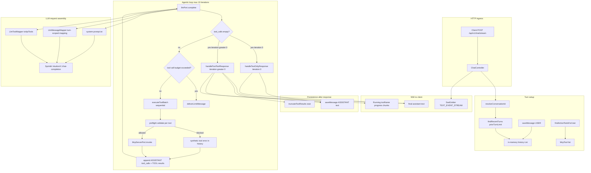
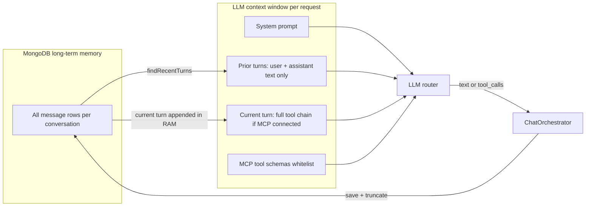

# LLM Context Management

This document describes **exactly** how the Sprinklr Developer Marketplace backend assembles, sends, persists, and trims context for every LLM call. It reflects the current code in `ChatOrchestrator`, `LlmMessageMapper`, `SprinklrLlmRouterAdapter`, and `MongoChatHistoryAdapter`.

---

## High-level overviewtoo

Each user chat turn is an **agentic loop**:

1. Load prior conversation history from MongoDB (turn-scoped window).
2. Persist the new user message and append it to in-memory history.
3. Load the user's active MCP tool schemas (whitelist for the `tools` array).
4. Call the LLM (`complete`) with system prompt + mapped history + tools.
5. If the LLM returns tool calls → execute them sequentially → append results to history → call LLM again.
6. If the LLM returns text → deliver to the user via SSE and persist the assistant reply.
7. After a successful tool turn, **truncate** raw tool JSON in MongoDB to a stub.

There is **no separate summary LLM pass** in the current orchestrator. The final assistant text after tool execution comes from the same `complete()` loop (iteration ≥ 1). `streamSummary()` still exists on `LlmPort` but is **not called** by `ChatOrchestrator` today.

---

## End-to-end flow



---

## Configuration knobs

| Property | Default | Effect |
|----------|---------|--------|
| `app.chat.history-turn-limit` | `5` | Max **user turns** in LLM context, including the current turn |
| `app.mcp.max-agentic-iterations` | `10` | Max LLM ↔ tool loop iterations per user message |
| `app.mcp.max-tool-calls-per-turn` | `15` | Max total MCP invocations per user message |
| `app.llm.system-prompt-path` | `classpath:llm/system-prompt.txt` | Base system prompt (loaded once at startup) |
| `app.llm.max-completion-tokens` | `30000` | Router output token cap |
| `app.llm.temperature` | `0.1` | Sampling temperature |
| `app.llm.model` | `gpt-4.1-2025-04-14` | Model sent to router |

Env overrides: `CHAT_HISTORY_TURN_LIMIT`, `MCP_MAX_AGENTIC_ITERATIONS`, `MCP_MAX_TOOL_CALLS_PER_TURN`, `LLM_STUB`, etc.

---

## What gets stored in MongoDB

Every chat turn writes one or more rows to the `messages` collection:

| Role | When saved | `content` | `toolCalls` | `toolResults` |
|------|------------|-----------|-------------|---------------|
| **USER** | Start of turn | User prompt text | empty | empty |
| **ASSISTANT** (tool pass) | LLM requests tools | usually `null` | tool name + arguments JSON | empty |
| **TOOL** | After MCP execution | `null` | empty | one row per tool call (full JSON or error text) |
| **ASSISTANT** (final) | LLM returns text | Final answer to user | empty | empty |

**UI history API** (`GET /api/v1/chat/history`) returns only USER and ASSISTANT rows that have non-blank `content`. Tool-call and tool-result rows are hidden from the frontend.

**Tool result truncation:** After a successful post-tool assistant reply, `truncateToolResults()` replaces each tool result body in MongoDB with:

```
[Tool result truncated after summarization]
```

The LLM has already consumed the full tool JSON during the current turn's agentic loop; truncation reduces long-term storage size. Truncated stubs are still in MongoDB but are handled differently in LLM mapping (see below).

---

## How history is loaded for the LLM

### Turn window (`findRecentTurns`)

At the start of each turn:

```java
int priorTurnLimit = Math.max(0, chatProperties.getHistoryTurnLimit() - 1);
history.addAll(chatHistoryPort.findRecentTurns(conversationId, priorTurnLimit));
```

With default `historyTurnLimit = 5`:

- `priorTurnLimit = 4` → load messages belonging to the **last 4 prior user turns**
- The **current** user message is saved and appended separately (5th user turn total in context)

Algorithm in `MongoChatHistoryAdapter.findRecentTurns`:

1. Fetch the N most recent **USER** messages (newest first).
2. Reverse to chronological order.
3. Take `createdAt` of the **oldest** of those N user messages as a cutoff timestamp.
4. Load **all messages** (USER, ASSISTANT, TOOL) from cutoff onward, ascending by time.

So the window is **turn-based**, not a flat “last K messages” cap. A single prior turn can include many rows (user + tool-call assistant + tool results + final assistant).

### In-memory history grows during the turn

Within one user message, the orchestrator **mutates** the same `history` list:

- After each tool batch: append ASSISTANT (tool_calls) + TOOL (results).
- The next `complete()` call sees the expanded history without re-querying MongoDB mid-turn.

---

## How history is mapped to the router `messages` array

Mapping is done by `LlmMessageMapper.toTurnScopedApiMessages()`. Every LLM `complete()` call receives:

### 1. System message (always first)

```
role: system
content: <contents of llm/system-prompt.txt>
```

Optionally replaced by `systemPromptOverride` on retry (see Tool-use retry below). Summary prompt is **not** used in the main agentic loop.

### 2. Prior turns → **conversational mode**

For messages **before** the current turn's USER message id:

| Stored role | Included in LLM payload? |
|-------------|--------------------------|
| USER with text | Yes → `role: user` |
| ASSISTANT with text | Yes → `role: assistant` |
| ASSISTANT with only `toolCalls` (no text) | **No** — dropped |
| TOOL | **No** — dropped |
| SYSTEM | **No** — dropped |

Prior turns therefore contribute only the **readable back-and-forth** (user questions + final assistant answers). Intermediate tool calls and raw tool JSON from old turns never reach the LLM again.

If a prior turn ended with tool use but the final assistant text was saved, the model sees: `user question → assistant summary`. It does **not** see how that summary was produced.

### 3. Current turn → **full agentic mode** (when tools are connected)

`SprinklrLlmRouterAdapter` sets:

```java
boolean fullToolHistoryForCurrentTurn = !request.tools().isEmpty();
```

If the user has **at least one active MCP tool**:

| Stored role | Included in LLM payload? |
|-------------|--------------------------|
| USER | Yes |
| ASSISTANT + tool_calls | Yes, with OpenAI-style `tool_calls` array |
| ASSISTANT text only | Yes |
| TOOL | Yes, one API message per result: `role: tool`, `content: <json or error>`, `tool_call_id` |

If the user has **no connected MCP tools** (`tools` array empty):

- Even the current turn uses **conversational mode** only (`fullToolHistoryForCurrentTurn = false`).
- `tool_choice` is `"none"`; the model cannot invoke tools.

### 4. User prompt is not duplicated

`LlmRequest.prompt()` is passed to the orchestrator for logging, preflight, and retry heuristics, but **is not** appended again by the mapper. The latest user text is already the last USER row in `history`.

---

## MCP tools in the LLM payload

### Tool whitelist

```java
List<McpTool> userTools = mcpRegistryPort.findActiveToolsForUser(request.userId());
```

- Only tools from **CONNECTED** MCP connections are included.
- Each tool name is prefixed: `{serverIdPrefix}.{toolName}` (e.g. `jira.searchJiraIssuesUsingJql`, `gitlab.get_commit`).
- Tool `description` and `inputSchemaJson` come from the last MCP `tools/list` discovery stored on the connection.
- Credentials are **never** sent to the LLM.

### Router `tools` + `tool_choice`

`LlmToolMapper`:

- Converts each `McpTool` to OpenAI function schema.
- `tool_choice`: `"auto"` if tools non-empty, `"none"` if empty.

### Tool execution order

Tool calls returned in one LLM response are executed **sequentially in order** (plain `for` loop, not parallel). Results are collected and written as one TOOL message with multiple `toolResults`.

---

## Preflight guard context

Before each MCP invoke:

```java
mcpInvocationPreflightPort.validate(invocation, request.prompt());
```

- Validation sees the **current turn's user prompt only** (`request.prompt()`), not full conversation history.
- If blocked (e.g. `JiraCreateIssuePreflightGuard`), a **synthetic failure** is stored as the tool result: `"Tool '…' blocked. …"`.
- That error is included in the next LLM iteration's TOOL messages so the model can ask the user for missing fields.

---

## LLM retry when tools are skipped

If the first `complete()` returns text-only but the user has tools connected, `SprinklrLlmRouterAdapter` may retry once with an appended nudge:

```
## Mandatory tool use (this request only)
The MCP tools array in this request is non-empty…
```

Retry triggers when `LlmToolUseRetryPolicy` detects either:

- The model falsely claims integrations are disconnected, or
- The user prompt looks like a live-data request (Jira/GitLab/MR/pipeline/deployment keywords + possessive/fetch phrasing).

Retry does **not** run if tool results already exist in the current turn (expected text-only exit after tools).

---

## Agentic loop exit paths

| Condition | Behavior |
|-----------|----------|
| LLM returns text, iteration `0` | Stream text to user; save ASSISTANT message; **no** tool truncation |
| LLM returns text, iteration `> 0` | Stream text; save ASSISTANT; **truncate** all TOOL messages from this turn |
| Tool call budget exceeded | Fixed message: *"Tool call limit reached…"* |
| Max iterations (`10`) exceeded | Same limit message |
| Exception | SSE error message via `LlmErrorFormatter` |

**Important:** There is no second LLM call with `summary-prompt.txt` after tools. The model's text response on the iteration after tool results **is** the user-facing answer.

---

## Example: what the LLM actually sees

Settings: `historyTurnLimit=5`, user has Jira connected, prior turn was “Show my tickets” → tool use → “You have PROJ-1”.

New user message: *“Add a comment on PROJ-1 saying LGTM”*

### Mapped `messages` array (iteration 0, before tools)

```
1. system     → full system-prompt.txt
2. user       → "Show my tickets"
3. assistant  → "You have PROJ-1"
4. user       → "Add a comment on PROJ-1 saying LGTM"
```

Prior turn's Jira tool calls and JSON are **not** present.

### After Jira tool runs (iteration 1)

```
1. system
2. user       → "Show my tickets"
3. assistant  → "You have PROJ-1"
4. user       → "Add a comment on PROJ-1 saying LGTM"
5. assistant  → tool_calls: [jira.addCommentToJiraIssue …]
6. tool       → {"success": true, …}   // full JSON
```

Model returns final text → user sees comment confirmation → TOOL row #6 truncated in MongoDB.

---

## What is **not** in LLM context

- MCP credentials, OAuth tokens, PATs
- Tool schemas for disconnected servers
- Prior turns' tool_calls and TOOL JSON (conversational stripping)
- Truncated tool stubs from **completed** prior turns (those TOOL rows are excluded anyway because prior turns use conversational mapping)
- Other users' conversations (enforced by `userId` on conversation lookup)
- Frontend-only data; only server-side Mongo history is used

---

## SSE streaming behavior

Despite the `/stream` endpoint, LLM responses are **not token-streamed** from the router today:

- **Text-only turn:** single SSE chunk with full assistant text.
- **Tool turn:** progress chunks (`Running get_commit…`) during MCP execution, then one final chunk with the post-tool assistant text.

True token streaming for `streamSummary()` is listed as future work in `docs/context.md` but is unused in the current orchestrator path.

---

## Key source files

| File | Responsibility |
|------|----------------|
| [`ChatOrchestrator.java`](../src/main/java/com/example/sprinklr/marketplace/application/service/ChatOrchestrator.java) | Agentic loop, history assembly, tool execution, truncation trigger |
| [`MongoChatHistoryAdapter.java`](../src/main/java/com/example/sprinklr/marketplace/infrastructure/outbound/persistence/MongoChatHistoryAdapter.java) | Turn-based history load, tool truncation |
| [`LlmMessageMapper.java`](../src/main/java/com/example/sprinklr/marketplace/infrastructure/outbound/llm/LlmMessageMapper.java) | Turn-scoped vs conversational mapping |
| [`SprinklrLlmRouterAdapter.java`](../src/main/java/com/example/sprinklr/marketplace/infrastructure/outbound/llm/SprinklrLlmRouterAdapter.java) | `complete()` + optional tool-use retry |
| [`LlmService.java`](../src/main/java/com/example/sprinklr/marketplace/infrastructure/outbound/llm/LlmService.java) | Builds router HTTP payload |
| [`LlmToolMapper.java`](../src/main/java/com/example/sprinklr/marketplace/infrastructure/outbound/llm/LlmToolMapper.java) | MCP tool schema → router `tools` |
| [`LlmSystemPromptLoader.java`](../src/main/java/com/example/sprinklr/marketplace/infrastructure/config/LlmSystemPromptLoader.java) | Loads system + summary prompt files |
| [`system-prompt.txt`](../src/main/resources/llm/system-prompt.txt) | Base copilot instructions |
| [`JiraCreateIssuePreflightGuard.java`](../src/main/java/com/example/sprinklr/marketplace/infrastructure/outbound/mcp/atlassian/JiraCreateIssuePreflightGuard.java) | Runtime block for invented Jira field values |

---

## Mental model (compact)



**Summary:** The LLM gets a fixed system prompt, a sliding window of recent **user turns** (default 5), prior turns as clean dialogue, the current turn as a full agentic trace when tools are active, and a per-user MCP tool whitelist. Raw tool JSON is kept only for the duration of the current turn's loop, then stubbed in MongoDB after the final answer is saved.
